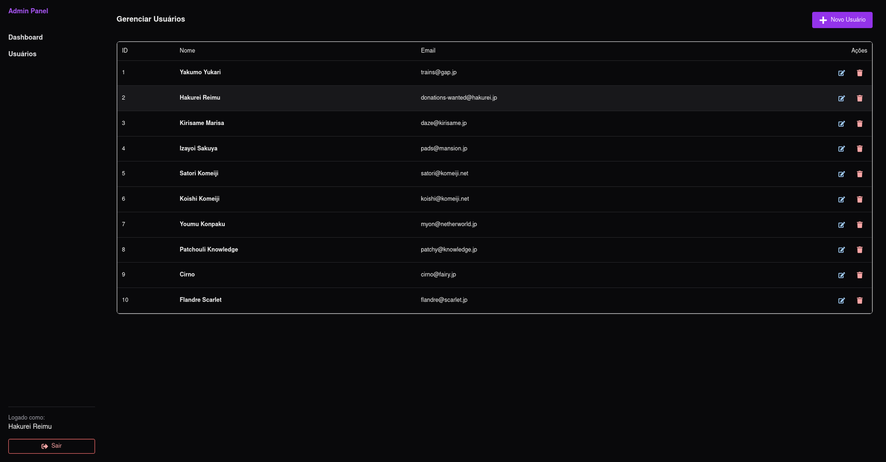
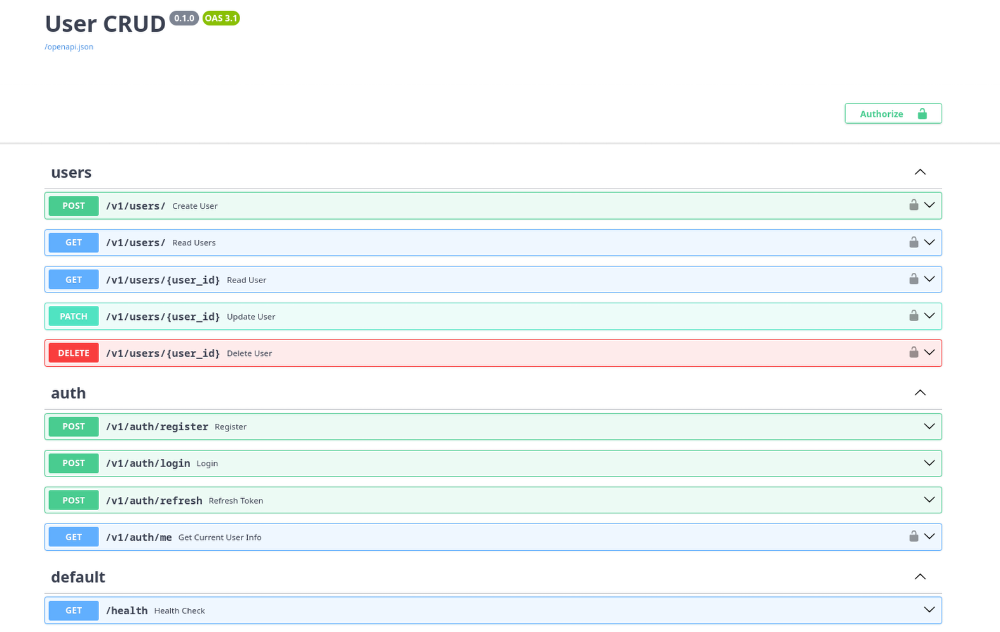

# Aplicação Full-Stack de Gerenciamento de Usuários

Uma aplicação web full-stack moderna para gerenciamento de usuários com autenticação, construída com **React (Frontend)** e **FastAPI (Backend)**.


## 🏗 Arquitetura

O projeto segue uma arquitetura modular e escalável:

### Frontend (React + TypeScript)



- **Framework**: React com Vite
- **Biblioteca de UI**: Chakra UI
- **Gerenciamento de Estado**: React Query (Estado do Servidor), Context API (Estado de Autenticação)
- **Estrutura**: Arquitetura baseada em features (conceitos de Domain Driven Design)
  - `features/`: Contém código específico do domínio (auth, users)
  - `components/`: Componentes de UI compartilhados
  - `pages/`: Componentes de rota
  - `services/`: Integração com API

### Backend (FastAPI + Python)

- **Framework**: FastAPI
- **Banco de Dados**: PostgreSQL (Async via SQLAlchemy + asyncpg)
- **Autenticação**: JWT (JSON Web Tokens) com fluxo de senha OAuth2
- **Estrutura**: Arquitetura em camadas
  - `api/`: Manipuladores de rota e dependências
  - `core/`: Configuração e segurança
  - `services/`: Lógica de negócios
  - `repositories/`: Camada de acesso ao banco de dados
  - `schemas/`: Modelos Pydantic para validação
  - `models/`: Modelos de banco de dados SQLAlchemy



### Banco de Dados

- **PostgreSQL**: Banco de dados relacional rodando em um container Docker.

---

## 🚀 Rodando o Projeto

O projeto utiliza um `Makefile` para simplificar o gerenciamento dos containers Docker.

### Pré-requisitos

- [Docker](https://www.docker.com/) e [Docker Compose](https://docs.docker.com/compose/) instalados.
- `make` instalado (geralmente já vem no Linux/macOS).

### Executando com comando único (Recomendado)

Basta rodar o comando abaixo na raiz do projeto:

```bash
make build && make up
```

Este comando irá:

1. Criar automaticamente o arquivo `.env` a partir do `.env.example` (se não existir).
2. Iniciar todos os containers em modo _detached_.

### Outros Comandos Úteis

| Comando              | Descrição                                        |
| :------------------- | :----------------------------------------------- |
| `make help`          | Lista todos os comandos disponíveis              |
| `make down`          | Para e remove os containers                      |
| `make logs`          | Visualiza os logs em tempo real                  |
| `make ps`            | Verifica o status dos serviços                   |
| `make test`          | Executa os testes do backend dentro do Docker    |
| `make seed-db`       | Preenche a tabela de usuários com dados de teste |
| `make db-shell`      | Acessa o shell do PostgreSQL                     |
| `make backend-shell` | Acessa o shell do backend                        |

### Variáveis de Ambiente

O projeto agora gerencia configurações através de um arquivo `.env`.
Ao rodar `make up`, um arquivo `.env` inicial é criado automaticamente com valores padrão seguros para desenvolvimento local.

Para customizar as credenciais do banco ou a `SECRET_KEY`, edite o arquivo `.env` criado.

---

### Acesso à Aplicação

- **Frontend**: [http://localhost:5173](http://localhost:5173)
- **Docs da API Backend (Swagger)**: [http://localhost:8000/docs](http://localhost:8000/docs)
- **Health Check**: [http://localhost:8000/health](http://localhost:8000/health)
